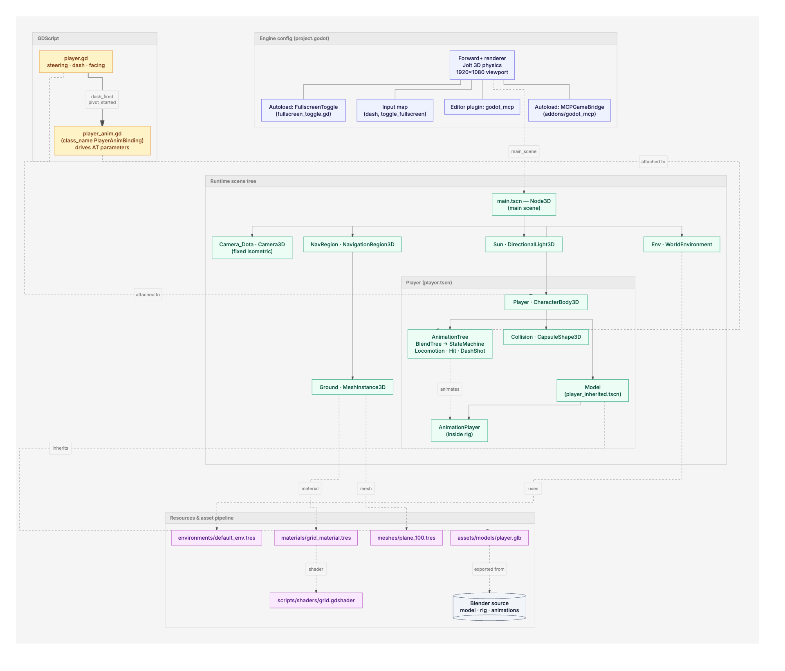
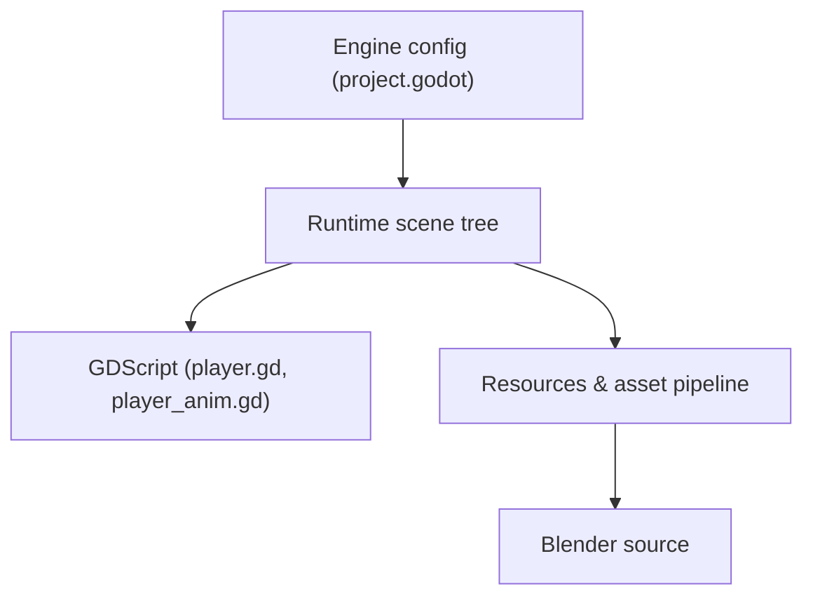

# Architecture

High-level view of `3d-proto-1`: how `project.godot`, the runtime scene tree, the GDScript layer, and the asset pipeline relate.

> Diagram source: [`architecture.mmd`](architecture.mmd). Re-render with `bun run ~/.claude/skills/beautiful-mermaid/scripts/render.ts --input docs/architecture.mmd --output docs/architecture --theme default`.

## Reading guide

- **Solid arrows** — scene-tree parent→child composition.
- **Dotted arrows** — cross-cutting references (config → autoload, script attachment, resource usage, inheritance).
- **Thick labelled arrows** (`==>`) — Godot signals between scripts.

## What it shows

1. `project.godot` wires four things at boot: the main scene, the input map, two autoloads, and the editor plugin.
2. `main.tscn` is the world; `player.tscn` is the only gameplay actor, composed of a physics body + a `.glb`-derived rig + an `AnimationTree`.
3. Two scripts split concerns: `player.gd` owns movement and emits gameplay signals; `player_anim.gd` translates those into `AnimationTree` parameters and one-shots.
4. The asset pipeline is one-directional: Blender → `.glb` → `player_inherited.tscn` → instanced as `Model`.
5. `godot_mcp` is editor-only infrastructure for Claude-driven editing — it has no role at game runtime beyond the `MCPGameBridge` autoload.

